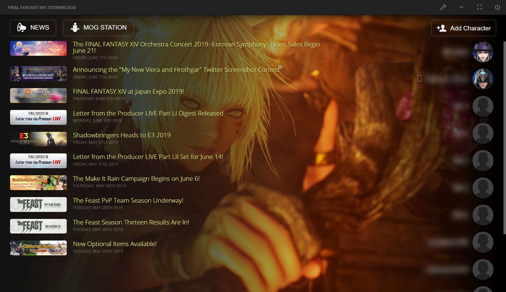

# FINAL FANTASY XIV: STORMBLOOD - CUSTOM LAUNCHER

A custom built launcher for FFXIV written in Javascript on Nodejs via Electron. Needs a lot of love to make it look good and be useful

> This is a Javascript implementation of: https://github.com/goaaats/FFXIVQuickLauncher

## Source files

- Styles: `src/css/**.scss`
- Javascript: `src/js/**.js`
- HTML: `public/index.html`

For images, you must host them somewhere, eg Github, Imgur or I can put them on XIVAPI.com

## Getting started

- Download repo
- cd `/repo/`
- `yarn`
- Start it: `electron .`

Electron is basically a chrome browser without a head (no address bar, buttons etc). The project will open dev tools and load the basic FFXIV Login form.

You can do modifications to the html, css or js and reload the app via: `CTRL+SHIFT+R`.

## Compiling the JS and SCSS

Make sure your IDE is set to: EMCAScript 6

(If you need SASS installed: `yarn add sass-loader node-sass --dev`)

- `yarn run encore dev --watch`

## Compile

- `yarn dist`

This will build an installation to: `/dist/FFXIV-Launcher Setup <version>.exe` which you can share and install.

## Dev Tools

Open with `CTRL+Shift+I`

# Preview

# Todo

- A lot.
- Add maintenance check (parse: http://frontier.ffxiv.com/worldStatus/gate_status.json)

---

# Updating the User-Agent

The latest ID can be obtained by using wireshark. Doesn't seem to matter much?

- Download: [WireShark](https://www.wireshark.org/)

Process:

- Open Wireshark and begin capturing network data
- Open the FFXIV Launcher Window
- Tab back to Wireshark and stop recording
- In the Wireshark filter bar, enter: `http contains SQEXAuthor`
- Select any of the `.html` requests
- Open up the data for `Hypertext Transfer Protocol`
- Look for: `User-Agent`

A valid user agent looks like this:

- `SQEXAuthor/2.0.0(Windows 6.2; ja-jp; 9e75ab3012)`

The important part is the end ID `9e75ab3012`, enter this in the `src/Settings.js` file, replacing what is currently there.
